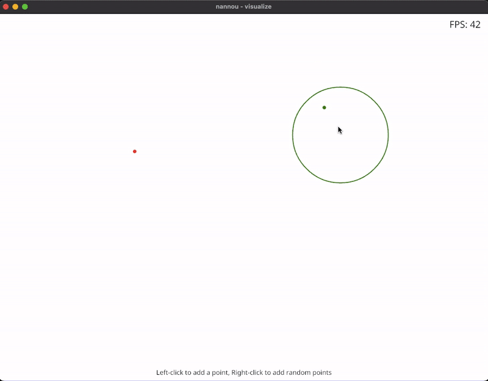

# QuadTree motivation

This repo implements a QuadTree (more correctly, an orthtree) in Rust. It is generic over the number of dimensions, the type of data stored, and the shape of the region being queried. Any struct that is `Storable` can be inserted. When querying, pass in any region that is `Query`. `Point` is automatically `Storable`

# Usage

```rust
use quadtree::{interval::Interval, point::Point, quadtree::QuadTree, region::Region};
use std::num::NonZero;
        
// Create a region, the bounds of the quadtree
let region = Region::new(&[
    Interval::try_new(0.0, 10.0)?, // X-axis
    Interval::try_new(0.0, 10.0)?, // Y-axis
]);

// Initialise the QuadTree with this region and the maximum number of points each
// individual node should store. You can store any Struct in the QuadTree as long as
// it implements the Storable trait.
// Here we're deferring the type of the QuadTree to the compiler,
// inferred from the first insert
let mut quadtree = QuadTree::new(&region, NonZero::new(4).expect("4 is non-zero"));

// Insert points into the QuadTree
for i in 0..4 {
    quadtree.insert(Point::new(&[i, 0]))?;
}

// To query the QuadTree, provide a region, or anything that implements the Query trait
let query_region = Region::new(&[
    Interval::try_new(0.0, 2.0)?,
    Interval::try_new(0.0, 10.0)?,
]);

let results: Vec<_> = quadtree.query(&query_region).collect();

assert_eq!(results.len(), 2);
```

# Visualisation

To run the `nannou` app, run `cargo run --bin visualize`.


